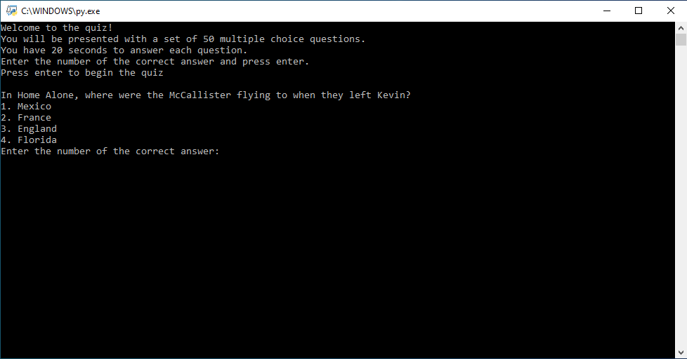

# quiz-application
This progrm defines a list of questions, each with a question and four answers to choose from. It then iterates through the questions, asking the user for an answer and comparing it to the correct answer. If the answer is correct, the user's score is incremented. At the end of the quiz, the program prints the user's final score.

Live demo [_here_](https://replit.com/@BartlomiejLis/quiz-application).

## Table of Contents
* [Tech Stack](#tech-stack)
* [Features](#features)
* [Screenshots](#screenshots)
* [Run Locally](#run-locally)
* [Project Status](#project-status)
* [Authors](#authors)

## Tech Stack
- Python

## Features
- Timer of 20 seconds per question:

  The timer starts at the beginning of each question and runs for a total of 20 seconds. After each question, the code checks if the time is up, if so, it prints the message "Time's up!", if not it continues to check the answer if it's correct or not.
- Multiple choice options
- Random order of questions and answers

## Screenshots


## Run Locally
Clone the project

```bash
  git clone https://github.com/bartlomiejlis/quiz-application.git
```

Go to the project directory and run main.py with Python.

The program works in a text form. Follow instructions on your screen to start using it.

## Project Status
Project is: _no longer being worked on_.

## Authors
Created by Bartłomiej Lis - feel free to contact me at lisu.b117@gmail.com!
